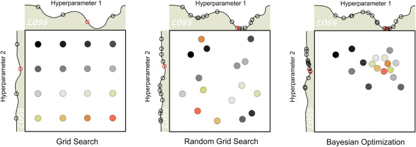
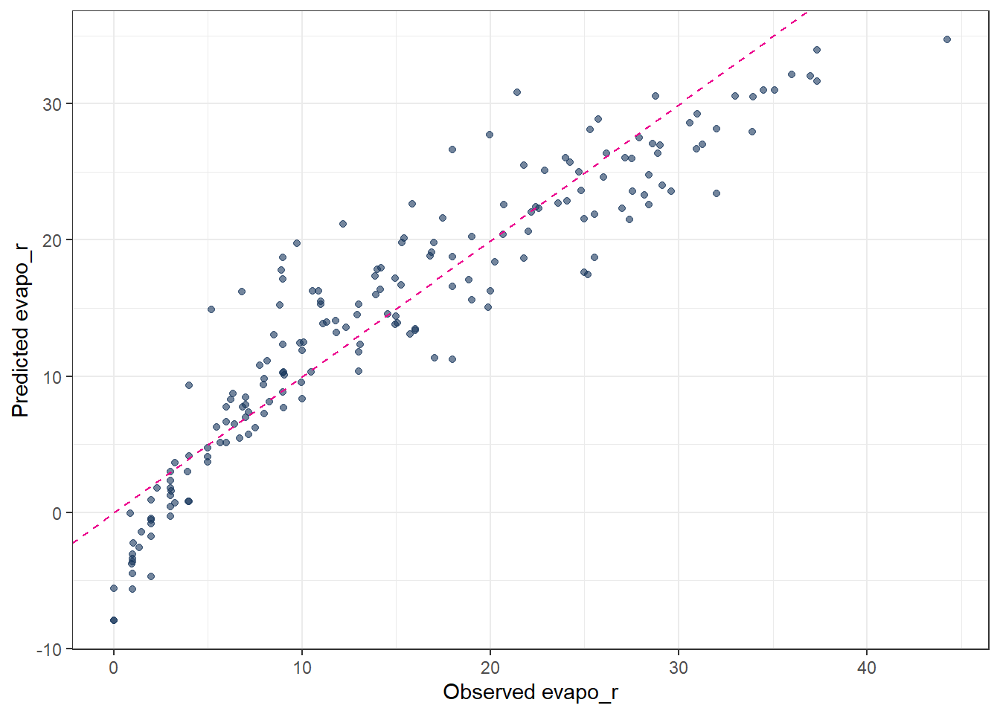
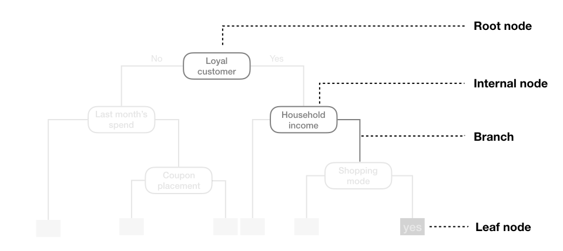
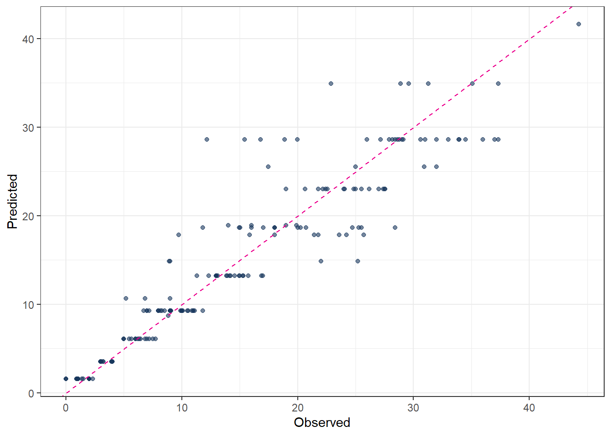
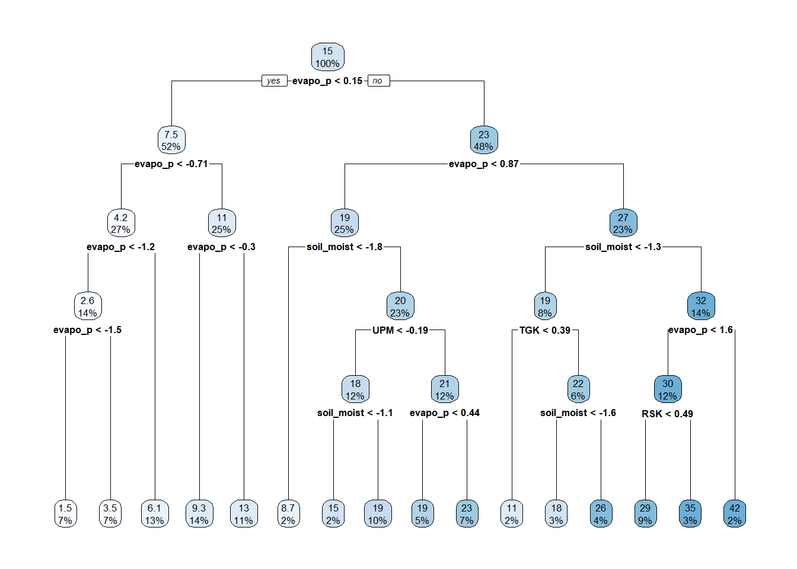
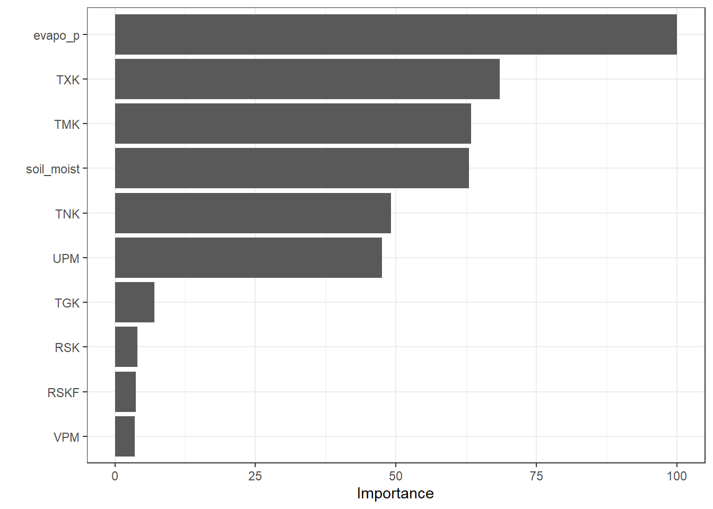
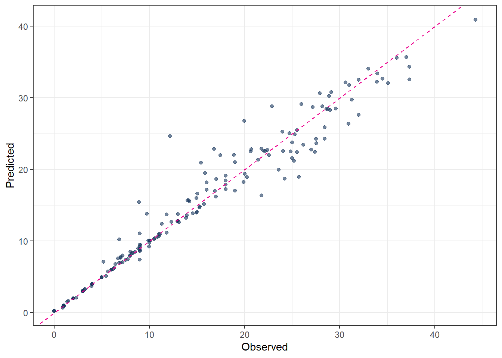
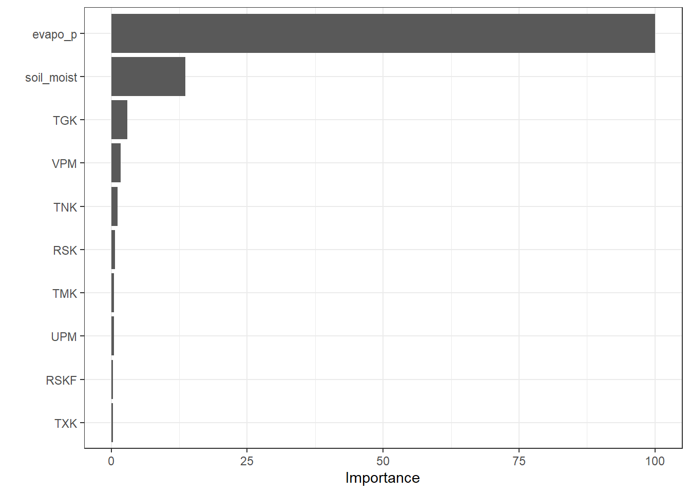
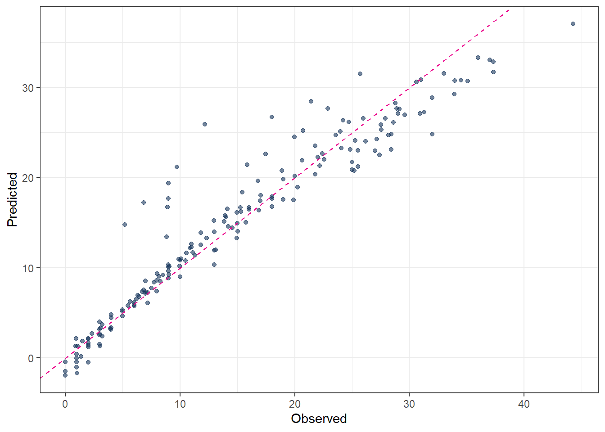
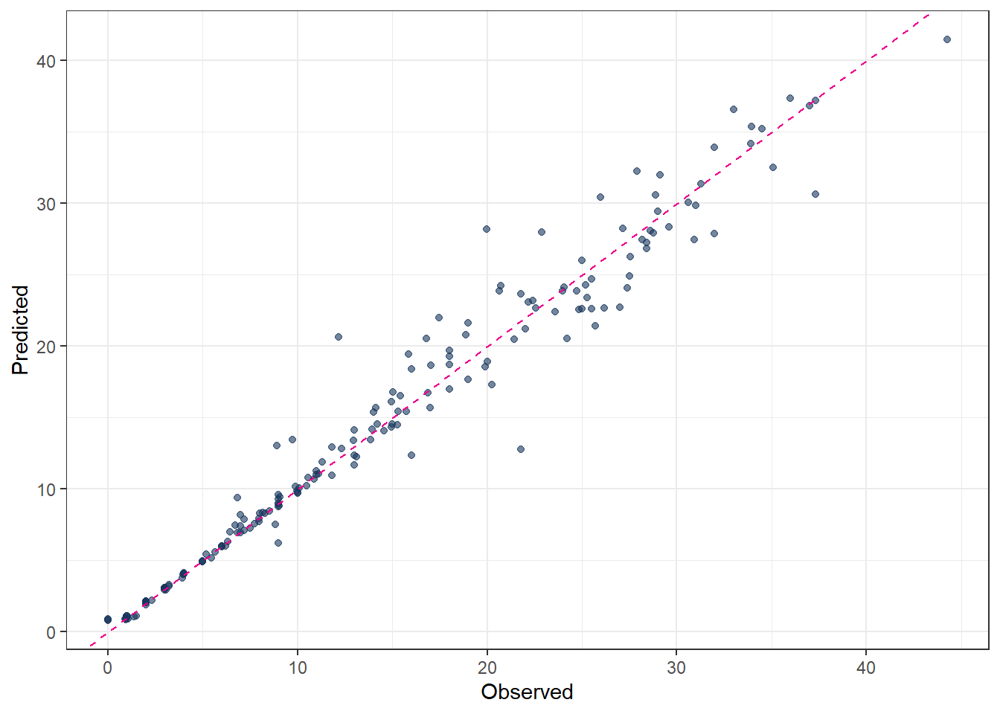

# Library and Data


::: {.cell}

```{.r .cell-code}
library(tidymodels)
library(tidyverse)
theme_set(theme_bw())
```
:::

::: {.cell}

```{.r .cell-code}
color_RUB_blue <- "#17365c"
color_RUB_green <- "#8dae10"
color_TUD_pink <- "#EC008D"

color_DRESDEN <- c("#03305D", "#28618C", "#539DC5", "#84D1EE", "#009BA4", "#13A983", "#93C356", "#BCCF02")
```
:::

::: {.cell}

```{.r .cell-code}
df_Bochum_KL <- read_csv("https://raw.githubusercontent.com/HydroSimul/Web/refs/heads/main/data_share/df_Bochum_KL.csv")
```
:::


## Data description

The dataset is collected and reconstructed from DWD climate data (link to be added) and focuses on actual evapotranspiration. It contains 11 variables:

- RSK   : daily precipitation sum [mm]  
- RSKF  : precipitation indicator (e.g. 1: rain / 4: snow) [-]  
- VPM   : mean vapor pressure [hPa]  
- TMK   : mean air temperature [°C]  
- UPM   : mean relative humidity [%]  
- TXK   : daily maximum air temperature [°C]  
- TNK   : daily minimum air temperature [°C]  
- TGK   : daily ground-level minimum temperature [°C]  
- evapo_p : potential evapotranspiration [mm], calculated using a standard empirical method  
- evapo_r : actual evapotranspiration [mm]  
- soil_moist : soil moisture content [mm]

The dataset comprises 731 observations (two years) in Sation Bochum. While most meteorological variables are directly measured at station, potential evapotranspiration, actual evapotranspiration, and soil moisture are extracted from raster-based products.

This study is formulated as a supervised learning regression task. Actual evapotranspiration (evapo_r) is used as the target variable, while the remaining 10 variables serve as feature variables. A feature space of size 10 is considered moderate; therefore, no dimensionality reduction techniques such as PCA or UMAP are applied.

Basic exploratory data analysis and data tidying have already been completed during the data preparation phase. Consequently, the feature engineering stage is limited to basic transformations and feature standardization. 

All regression models presented in the following sections use the same feature engineering `rcp_Norm`.


::: {.cell}

```{.r .cell-code}
# Train–test split (75% / 25%)
split_Bochum <- initial_split(df_Bochum_KL, prop = 3/4)
df_Train <- training(split_Bochum)
df_Test  <- testing(split_Bochum)


# Preprocessing recipe (normalize + PCA)
rcp_Norm <- 
  recipe(evapo_r ~ ., data = df_Train) |>
  # step_mutate(RSKF = as.factor(RSKF)) |>
  # step_dummy(RSKF) |>
  step_YeoJohnson(all_numeric_predictors()) |> 
  step_normalize(all_numeric_predictors())
```
:::


# Tuning Parameters

As discussed in the previous article, the basic workflow for model fitting using the **tidymodels** framework consists of the following steps:

1. Split the data into training and test sets.  
2. Perform feature engineering using a recipe.  
3. Specify the model.  
4. Define the workflow by combining the recipe and the model specification.  
5. Fit the model to the training data.  
6. Generate predictions.  
7. Validate the model.

In standard model fitting, the hyperparameters of the modeling method remain fixed. However, these parameters can also be modified and optimized. This optimization process is referred to as **tuning** rather than **fitting**. When tuning is included, several steps in the workflow change:

1. Split the data into resampled sets, typically using cross-folds.  
2. Perform feature engineering using a recipe.  
3. Specify the model, leaving the hyperparameters unset by using the `tune()` function so that they can be optimized.  
4. Define a workflow designed for tuning.  
5. Define the parameter ranges to be explored.  
6. Specify the tuning search strategy, such as grid search or iterative search.  
7. Conduct the tuning procedure.  
8. Identify the best-performing parameter values.  
9. Use the tuned parameters to construct the final model.  
10. Fit the final model to the training data.  
11. Generate predictions.  
12. Validate the final model.

The aim of tuning is to identify the optimal set of hyperparameters for a given model. In general, two main search strategies are used to evaluate hyperparameter combinations: **grid search** and **iterative (sequential) search**.



## Grid search

Grid search involves **predefining a set of hyperparameter values** and evaluating all possible combinations. The key design choices are how the grid is constructed and how many combinations are included. Grid search is often criticized for being computationally inefficient, especially in high-dimensional hyperparameter spaces. However, this inefficiency mainly arises when the grid is poorly designed. With a well-chosen grid, grid search can be effective and straightforward. Strategies for efficient grid construction are discussed in Chapter 13.

Typical variants include:
- `grid_regular(levels = 3)`: a structured grid with evenly spaced values for each hyperparameter  
- `grid_random(size = 30)`: 30 randomly sampled combinations, which are not evenly spaced but often provide broader coverage of the parameter space  

## Iterative (sequential) search

Iterative or sequential search methods **identify promising hyperparameter combinations step by step, guided by the results of previous evaluations**. These methods adaptively explore the parameter space and can be much more efficient than grid search for complex or high-dimensional problems. Many nonlinear optimization algorithms fall into this category, although their performance can vary. In some cases, an initial set of hyperparameter combinations must be evaluated to initialize the search. Iterative tuning strategies are discussed in more detail in Chapter 14.

## Manual search

When prior experience or guidance from the literature is available, **manual search** can also be effective. In this approach, expert knowledge is used to reduce the number of hyperparameters to tune or to restrict their plausible ranges. Although manual search is less systematic, it can substantially decrease computational cost and is often useful as a preliminary step before applying automated tuning methods.


# Linear regression

Linear regression is a classical supervised learning method used to estimate the linear relationship between one or more predictors and a continuous outcome variable.  
In practice, most applications involve several predictors, so the standard approach is the *multiple linear regression* model, where the response is modeled as a linear combination of all predictors.

For predictors $x_1, x_2, ..., x_p$, the model is:

$$
y = \beta_0 + \beta_1 x_1 + \beta_2 x_2 + \cdots + \beta_p x_p + \varepsilon
$$

where  
- $y$ is the outcome,  
- $\beta_0$ is the intercept,  
- $\beta_j$ are the coefficients showing the contribution of each predictor,  
- $\varepsilon$ is the random error.

The goal is to estimate the coefficients $\beta$ so that the model predicts $y$ as well as possible.


::: {.cell}

```{.r .cell-code}
# define linear regression model using base R lm engine
mdl_Mlm <- 
  linear_reg() |>
  set_engine("lm")

# build workflow: preprocessing recipe + model
wflow_Norm_Mlm <- 
  workflow() |>
  add_recipe(rcp_Norm) |>
  add_model(mdl_Mlm)

# fit the workflow on training data
fit_Norm_Mlm <- 
  wflow_Norm_Mlm |>
  fit(data = df_Train)

# generate predictions on test data
pred_Mlm <- 
  predict(fit_Norm_Mlm, df_Test) |>
  bind_cols(df_Test |> dplyr::select(evapo_r))

# evaluate model performance (e.g. RMSE, MAE, R²)
metrics(pred_Mlm, truth = evapo_r, estimate = .pred)
```

::: {.cell-output .cell-output-stdout}

```
# A tibble: 3 × 3
  .metric .estimator .estimate
  <chr>   <chr>          <dbl>
1 rmse    standard       4.32 
2 rsq     standard       0.820
3 mae     standard       3.03 
```


:::

```{.r .cell-code}
# observed vs. predicted scatter plot
ggplot(pred_Mlm, aes(x = evapo_r, y = .pred)) +
  geom_point(alpha = 0.6, color = color_RUB_blue) +
  geom_abline(
    intercept = 0, slope = 1,
    linetype = "dashed", color = color_TUD_pink
  ) +
  labs(
    x = "Observed evapo_r",
    y = "Predicted evapo_r"
  )
```

::: {.cell-output-display}
{width=672}
:::
:::


# Regularization

For ordinary linear regression (using the `lm` engine), there are no hyperparameters to tune. However, once regularization is introduced (ridge, lasso, or elastic net), an additional penalty term is added to the loss function in order to prevent overfitting.

In regression, instead of minimizing only the training error (e.g. the sum of squared residuals), the objective function becomes

  training error + penalty on model parameters

This penalty constrains the size or structure of the regression coefficients and serves three main purposes:
- reduce overfitting by preventing the model from fitting noise in the training data  
- improve generalization performance on unseen data  
- mitigate multicollinearity by stabilizing coefficient estimates  

More specifically:
- Ridge regression applies an L2 penalty (the sum of squared coefficients). It shrinks coefficients toward zero but typically does not set them exactly to zero.
- Lasso regression applies an L1 penalty (the sum of absolute coefficients). This can force some coefficients to become exactly zero, effectively performing variable selection.
- Elastic net combines L1 and L2 penalties, providing a balance between sparsity (lasso) and stability (ridge).

In summary, regularization controls model complexity by penalizing large or unstable parameter values during model fitting.


## Regularization hyperparameters

Regularized regression models must control **how strong** the penalty is and **which type** of penalty is applied. These controls are implemented as **hyperparameters**, most commonly:

- `penalty` (λ): controls the overall strength of regularization  
- `mixture` (α): controls the type of regularization  
  - α = 0 corresponds to ridge regression  
  - α = 1 corresponds to lasso regression  
  - 0 < α < 1 corresponds to elastic net  

Different regression methods therefore differ in their **loss functions** and **regularization strategies**. The key distinction from ordinary linear regression is the presence of these hyperparameters (`penalty` and `mixture`), which determine the amount and form of regularization applied to the model.

## Ordinary Least Squares (OLS)

- No regularization → **no hyperparameters**.  
- The solution is obtained analytically by minimizing the sum of squared residuals.

$$
\min_{\beta} \sum_{i=1}^n (y_i - \hat{y}_i)^2
$$

Because there is no penalty term, the model can overfit when predictors are highly correlated.

## Ridge Regression (L2 penalty)

- Introduces **one hyperparameter**:  
  - `penalty` (lambda): strength of coefficient shrinkage  
- `mixture` is fixed to **0**, meaning pure L2 regularization.

$$
\min_{\beta} \left(
\sum_{i=1}^n (y_i - \hat{y}_i)^2
+ \lambda \sum_{j=1}^p \beta_j^2
\right)
$$

Large lambda → strong shrinkage.  
Coefficients approach zero but never become exactly zero.

## Lasso Regression (L1 penalty)

- Also uses **one hyperparameter**:  
  - `penalty` (lambda): controls how strongly coefficients are pushed toward zero  
- `mixture` is fixed to **1**, meaning pure L1 regularization.

$$
\min_{\beta} \left(
\sum_{i=1}^n (y_i - \hat{y}_i)^2
+ \lambda \sum_{j=1}^p |\beta_j|
\right)
$$

Large lambda → many coefficients become exactly zero → feature selection.

## Elastic Net Regression (combined L1 + L2)

- Uses **two hyperparameters**:
  - `penalty` (lambda): global strength of shrinkage  
  - `mixture` (alpha): balance between L1 and L2  
    - alpha = 0 → ridge  
    - alpha = 1 → lasso  
    - 0 < alpha < 1 → mixture

$$
\min_{\beta} \left(
\sum_{i=1}^n (y_i - \hat{y}_i)^2
+ \lambda \left[
\alpha \sum_{j=1}^p |\beta_j|
+ (1-\alpha) \sum_{j=1}^p \beta_j^2
\right]
\right)
$$

Elastic Net is useful when predictors are correlated and when both shrinkage and feature selection are desired.

## Tuning Parameters of regularization

Summary of Hyperparameter Settings:

| Method        | penalty (lambda) | mixture (alpha) | Regularization |
|---------------|------------------|------------------|----------------|
| OLS           | not used         | not used         | none |
| Ridge         | yes              | 0                | L2 |
| Lasso         | yes              | 1                | L1 |
| Elastic Net   | yes              | 0 < α < 1        | L1 + L2 |

In practice, `penalty` and `mixture` are usually selected using **cross-validation**, since the optimal values depend on the dataset.


1. Split the data into resampled sets
  define the parameter “Number of partitions” `v` which means how many subsets (folds) the dataset is split into for cross-validation.

In v-fold cross-validation:

- The data are divided into v roughly equal-sized parts (folds).
- The model is trained v times.
- Each time, 1 fold is held out as validation data, and the remaining v−1 folds are used for training.
- The performance is averaged over the v runs.


::: {.cell}

```{.r .cell-code}
## folds ---------
set.seed(111)
cv_folds_Norm <- vfold_cv(df_Train, v = 10)
```
:::


2. Feature engineering using a recipe  
The feature engineering step is performed using a preprocessing recipe, which has already been defined in the previous section. 

3. Model specification with tunable hyperparameters  
Next, the regression model is specified while leaving the hyperparameters unset by using the `tune()` function. This allows the hyperparameters to be optimized during the tuning process rather than fixed in advance. The model structure (e.g. linear regression with regularization) is defined at this stage, while the optimal values of the hyperparameters are determined later through the chosen tuning strategy.


::: {.cell}

```{.r .cell-code}
## Model with tunable hyperparameters ------------------------------
mdl_tune_EN <- 
  linear_reg(
    penalty = tune(),   # lambda
    mixture = tune()    # alpha
  ) |>
  set_engine("glmnet")
```
:::


4. Define a workflow designed for tuning.


::: {.cell}

```{.r .cell-code}
## Workflow -------------------------

wflow_tune_EN <- 
  workflow() |>
  add_recipe(rcp_Norm) |>
  add_model(mdl_tune_EN)
```
:::


5. Define the parameter ranges to be explored  

The ranges of the hyperparameters to be tuned must be specified before the tuning process. In most cases, reasonable default ranges are already stored within the model specification. These predefined ranges can be directly extracted using the `extract_parameter_set_dials()` function. This approach ensures that the tuning process starts from sensible and model-appropriate parameter bounds, while still allowing the ranges to be adjusted if prior knowledge or problem-specific considerations are available.


::: {.cell}

```{.r .cell-code}
param_tune_EN <- 
  extract_parameter_set_dials(wflow_tune_EN)

param_tune_EN_final <- 
  param_tune_EN |>
  finalize(df_Train)
```
:::


6. Specify the tuning search strategy  

The tuning search strategy determines how hyperparameter combinations are generated and evaluated. Common approaches include grid search and iterative (sequential) search.

For grid search, `grid_regular()` is often used. This function divides the predefined parameter ranges into a specified number of evenly spaced values using the `levels` argument. The full grid is then formed by evaluating all possible combinations of these values across the hyperparameters. A larger number of levels increases the resolution of the search but also raises the computational cost.


::: {.cell}

```{.r .cell-code}
## Hyperparameter grid -------------

grid_EN <- 
  grid_regular(
    param_tune_EN_final,
    levels = 6
  )
```
:::


7. Conduct the tuning procedure.


::: {.cell}

```{.r .cell-code}
set.seed(123)
tune_EN <- 
  tune_grid(
    wflow_tune_EN,
    resamples = cv_folds_Norm,
    grid = grid_EN,
    metrics = metric_set(rmse, mae, rsq),
    control = control_grid(save_pred = TRUE)
  )
```
:::


8. Identify the best-performing parameter values.


::: {.cell}

```{.r .cell-code}
## Show best hyperparameters -------

show_best(tune_EN, metric = "rmse")
```

::: {.cell-output .cell-output-stdout}

```
# A tibble: 5 × 8
       penalty mixture .metric .estimator  mean     n std_err .config           
         <dbl>   <dbl> <chr>   <chr>      <dbl> <int>   <dbl> <chr>             
1 0.0000000001    0.43 rmse    standard    3.92    10   0.134 Preprocessor1_Mod…
2 0.00000001      0.43 rmse    standard    3.92    10   0.134 Preprocessor1_Mod…
3 0.000001        0.43 rmse    standard    3.92    10   0.134 Preprocessor1_Mod…
4 0.0001          0.43 rmse    standard    3.92    10   0.134 Preprocessor1_Mod…
5 0.0000000001    0.62 rmse    standard    3.92    10   0.134 Preprocessor1_Mod…
```


:::
:::


9. Use the tuned parameters to construct the final model.


::: {.cell}

```{.r .cell-code}
## Finalize model with best hyperparameters -------------------------
best_params_EN <- select_best(tune_EN, metric = "rmse")
wflow_final_EN <- finalize_workflow(wflow_tune_EN, best_params_EN)
```
:::


10. Fit the final model to the training data.


::: {.cell}

```{.r .cell-code}
fit_final_EN <- fit(wflow_final_EN, df_Train)
```
:::


11. Generate predictions.


::: {.cell}

```{.r .cell-code}
pred_final_EN <- 
  predict(fit_final_EN, df_Test) |>
  bind_cols(df_Test |> dplyr::select(evapo_r))
```
:::


12. Validate the final model.


::: {.cell}

```{.r .cell-code}
metrics(pred_final_EN, truth = evapo_r, estimate = .pred)
```

::: {.cell-output .cell-output-stdout}

```
# A tibble: 3 × 3
  .metric .estimator .estimate
  <chr>   <chr>          <dbl>
1 rmse    standard       4.32 
2 rsq     standard       0.819
3 mae     standard       3.02 
```


:::
:::


# Decision Trees

Tree-based models are a class of nonparametric algorithms that work by partitioning the feature space into a set of smaller, non-overlapping regions with similar response values using a series of splitting rules. Predictions are obtained by fitting a simple model within each region, typically a constant such as the mean response value. These divide-and-conquer methods yield intuitive decision rules that are easy to interpret and visualize using tree diagrams [@MLR_Boehmke_2019].

One of the most widely used tree-based methods is the Classification and Regression Tree (CART) algorithm. CART first partitions the feature space into increasingly homogeneous subgroups and then applies a simple constant prediction within each terminal node. In this sense, tree-based regression can be viewed as a sequence of classification-like splits followed by local regression within each region.

A CART tree can be described in terms of a root node, internal nodes, branches, and leaf nodes. The model uses binary recursive partitioning, meaning that each internal node is always split into exactly two child nodes.



## Hyperparameters

There are three main hyperparameters in a CART model:

1. `cost_complexity` (also called `cp` or alpha)  
   This parameter controls the complexity of the tree by adding a penalty for each additional split. A higher value encourages simpler trees by pruning branches that provide little improvement in predictive accuracy, while a smaller value allows more complex trees to grow.

2. `tree_depth` (or `max_depth`)  
   This defines the maximum number of levels in the tree from the root node to the deepest leaf. Limiting tree depth helps prevent overfitting, especially when the dataset is small or noisy, by restricting the number of splits.

3. `min_n` (or `min_samples_split`)  
   This specifies the minimum number of observations that must be present in a node for it to be eligible for splitting. Larger values produce more generalized trees, while smaller values allow the tree to fit more detailed patterns in the data.

These hyperparameters determine the size, structure, and complexity of the tree and have a direct impact on its predictive performance. Proper tuning is crucial to achieve a balance between underfitting and overfitting.

## Codes


::: {.cell}

```{.r .cell-code}
# 2. Define tunable Decision Tree model
mdl_tune_DT <- 
  decision_tree(
    cost_complexity = tune(),   # pruning parameter (CCP)
    tree_depth      = tune(),   # maximum depth
    min_n           = tune()    # minimum number of data points in a node
  ) |>
  set_engine("rpart") |>
  set_mode("regression")

# 3. Workflow (recipe + model)
wflow_tune_DT <- 
  workflow() |>
  add_recipe(rcp_Norm) |>
  add_model(mdl_tune_DT)

# 4. Hyperparameter grid
set.seed(123)
grid_DT <- grid_random(
  cost_complexity(range = c(-5, -0.5)),  # .00001 to .3 (log scale)
  tree_depth(range = c(2, 5)),
  min_n(range = c(2, 40)),
  size = 30     # number of random grid combinations
)

# 5. Cross-validated tuning
set.seed(123)
tune_DT <- 
  tune_grid(
    wflow_tune_DT,
    resamples = cv_folds_Norm,
    grid = grid_DT,
    metrics = metric_set(rmse, rsq, mae),
    control = control_grid(save_pred = TRUE)
  )

# 6. Best hyperparameters
show_best(tune_DT, metric = "rmse")
```

::: {.cell-output .cell-output-stdout}

```
# A tibble: 5 × 9
  cost_complexity tree_depth min_n .metric .estimator  mean     n std_err
            <dbl>      <int> <int> <chr>   <chr>      <dbl> <int>   <dbl>
1        0.00113           5    22 rmse    standard    3.28    10   0.162
2        0.00110           5    27 rmse    standard    3.31    10   0.181
3        0.000299          4    23 rmse    standard    3.84    10   0.182
4        0.000692          4    13 rmse    standard    3.89    10   0.225
5        0.00238           4    28 rmse    standard    3.97    10   0.199
# ℹ 1 more variable: .config <chr>
```


:::

```{.r .cell-code}
best_prams_DT <- select_best(tune_DT, metric = "rmse")

# 7. Final model with tuned hyperparameters
wflow_final_DT <- 
  finalize_workflow(wflow_tune_DT, best_prams_DT)

fit_final_DT <- fit(wflow_final_DT, df_Train)

# Predict
pred_final_DT <- 
  predict(fit_final_DT, df_Test) |>
  bind_cols(df_Test |> dplyr::select(evapo_r))

# Metrics
metrics(pred_final_DT, truth = evapo_r, estimate = .pred)
```

::: {.cell-output .cell-output-stdout}

```
# A tibble: 3 × 3
  .metric .estimator .estimate
  <chr>   <chr>          <dbl>
1 rmse    standard       4.06 
2 rsq     standard       0.838
3 mae     standard       2.41 
```


:::

```{.r .cell-code}
# Plot predicted vs observed
ggplot(pred_final_DT, aes(x = evapo_r, y = .pred)) +
  geom_point(alpha = 0.6, color = color_RUB_blue) +
  geom_abline(
    intercept = 0,
    slope = 1,
    linetype = "dashed",
    color = color_TUD_pink
  ) +
  labs(
    x = "Observed",
    y = "Predicted"
  )
```

::: {.cell-output-display}
{width=672}
:::
:::


The predicted results from a decision tree illustrate the "classification" concept clearly: each terminal node corresponds to a group of observations with a constant predicted value. However, the predictive accuracy may not always be satisfactory, especially for complex relationships in the data.

The final fitted decision tree can be visualized as follows. From the plot, it is evident that the predictor `evapo_p` is used multiple times at different levels of the tree. This suggests that `evapo_p` is a highly important variable in explaining the target variable.


::: {.cell}

```{.r .cell-code}
# extract the fitted parsnip model from the workflow
fit_Tree <- 
  fit_final_DT |>
  extract_fit_parsnip()

# extract the underlying rpart object
plot_Tree <- fit_Tree$fit

# plot the decision tree
rpart.plot::rpart.plot(plot_Tree)
```

::: {.cell-output-display}
{width=672}
:::
:::


In addition to the tree structure plot, a Variable Importance Plot (VIP) provides a complementary view. It ranks the predictors according to their contribution to the model and highlights which variables have the most influence on predictions.


::: {.cell}

```{.r .cell-code}
vip::vip(fit_Tree, scale = TRUE)
```

::: {.cell-output-display}
{width=672}
:::
:::


# Random Forest

Random forest is an improved decision tree algorithm that builds an ensemble of many decision trees to enhance predictive performance and reduce overfitting. Instead of relying on a single tree, random forest aggregates the predictions from multiple trees, each trained on a different bootstrap sample of the data and using a random subset of predictors at each split. This combination of bagging (bootstrap aggregating) and feature randomness increases model stability, improves generalization, and reduces the variance associated with a single decision tree.

## Hyperparameters

Random forest has several key hyperparameters that control the ensemble's complexity and performance:

1. `mtry`  
   The number of predictors randomly sampled at each split. Smaller values increase tree diversity and reduce correlation among trees, while larger values allow stronger predictors to dominate splits.

2. `trees` 
   The total number of trees in the forest. Increasing the number of trees usually improves stability and accuracy, but with diminishing returns beyond a certain point.

3. `min_n` 
   The minimum number of observations required to split a node. Larger values produce simpler trees and reduce overfitting, while smaller values allow more detailed splits.


These hyperparameters determine the balance between bias and variance in the ensemble and are typically tuned to optimize predictive performance. Proper tuning ensures that the random forest captures important patterns while remaining robust to noise in the data.

## Codes


::: {.cell}

```{.r .cell-code}
# 2. Define tunable Random Forest model
mdl_tune_RF <- 
  rand_forest(
    trees = tune(),   # number of trees
    mtry  = tune(),   # number of predictors sampled at each split
    min_n = tune()    # minimum node size
  ) |>
  set_engine("ranger", importance = "permutation") |>
  set_mode("regression")

# 3. Workflow (recipe + model)
wflow_tune_RF <- 
  workflow() |>
  add_recipe(rcp_Norm) |>
  add_model(mdl_tune_RF)

# 4. Hyperparameter grid (extracted from workflow)
param_tune_RF <- extract_parameter_set_dials(wflow_tune_RF)

# Update mtry with the actual number of predictors
param_tune_RF <- param_tune_RF |>
  update(mtry = mtry(range = c(1, ncol(df_Train) - 1)))

# 5. Create grid
set.seed(123)
grid_RF <- grid_regular(
  param_tune_RF,
  levels = 3
)

# 6. Cross-validated tuning
set.seed(123)
tune_RF <- 
  tune_grid(
    wflow_tune_RF,
    resamples = cv_folds_Norm,
    grid = grid_RF,
    metrics = metric_set(rmse, rsq, mae),
    control = control_grid(save_pred = TRUE)
  )

# 7. Best hyperparameters
show_best(tune_RF, metric = "rmse")
```

::: {.cell-output .cell-output-stdout}

```
# A tibble: 5 × 9
   mtry trees min_n .metric .estimator  mean     n std_err .config              
  <int> <int> <int> <chr>   <chr>      <dbl> <int>   <dbl> <chr>                
1    10  1000     2 rmse    standard    2.30    10  0.141  Preprocessor1_Model06
2    10  2000     2 rmse    standard    2.30    10  0.139  Preprocessor1_Model09
3     5  1000     2 rmse    standard    2.53    10  0.0961 Preprocessor1_Model05
4     5  2000     2 rmse    standard    2.53    10  0.0971 Preprocessor1_Model08
5    10  2000    21 rmse    standard    2.55    10  0.147  Preprocessor1_Model18
```


:::

```{.r .cell-code}
best_prams_RF <- select_best(tune_RF, metric = "rmse")

# 8. Final model with tuned hyperparameters
wflow_final_RF <- 
  finalize_workflow(wflow_tune_RF, best_prams_RF)

fit_final_RF <- fit(wflow_final_RF, df_Train)

# Predict
pred_final_RF <- 
  predict(fit_final_RF, df_Test) |>
  bind_cols(df_Test |> dplyr::select(evapo_r))

# Metrics
metrics(pred_final_RF, truth = evapo_r, estimate = .pred)
```

::: {.cell-output .cell-output-stdout}

```
# A tibble: 3 × 3
  .metric .estimator .estimate
  <chr>   <chr>          <dbl>
1 rmse    standard       2.48 
2 rsq     standard       0.938
3 mae     standard       1.37 
```


:::

```{.r .cell-code}
# Plot predicted vs observed
ggplot(pred_final_RF, aes(x = evapo_r, y = .pred)) +
  geom_point(alpha = 0.6, color = color_RUB_blue) +
  geom_abline(
    intercept = 0,
    slope = 1,
    linetype = "dashed",
    color = color_TUD_pink
  ) +
  labs(
    x = "Observed",
    y = "Predicted"
  )
```

::: {.cell-output-display}
{width=672}
:::
:::

::: {.cell}

```{.r .cell-code}
# extract the fitted parsnip model from the workflow
fit_RandomForest <- 
  fit_final_RF |>
  extract_fit_parsnip()

# variable importance plot with scaled values
vip::vip(fit_RandomForest, geom = "col", scale = TRUE)
```

::: {.cell-output-display}
{width=672}
:::
:::


# SVM


::: {.cell}

```{.r .cell-code}
# Tunable SVM model (RBF kernel) --------------------------------

# 1. Cross-validation folds (already created)
set.seed(123)
cv_folds_Norm <- vfold_cv(df_Train, v = 10)

# 2. Define tunable SVM model
mdl_tune_SVM <-
  svm_rbf(
    cost      = tune(),   # C penalty
    rbf_sigma = tune()    # kernel width
  ) |>
  set_engine("kernlab") |>
  set_mode("regression")

# 3. Workflow (recipe + model)
wflow_tune_SVM <-
  workflow() |>
  add_recipe(rcp_Norm) |>
  add_model(mdl_tune_SVM)

# 4. Hyperparameter grid
param_tune_SVM <- extract_parameter_set_dials(wflow_tune_SVM)

set.seed(123)
grid_SVM <- grid_random(
  param_tune_SVM,
  size = 50
)

# 5. Cross-validated tuning
set.seed(123)
tune_SVM <-
  tune_grid(
    wflow_tune_SVM,
    resamples = cv_folds_Norm,
    grid = grid_SVM,
    metrics = metric_set(rmse, rsq, mae),
    control = control_grid(save_pred = TRUE)
  )

# 6. Best hyperparameters
show_best(tune_SVM, metric = "rmse")
```

::: {.cell-output .cell-output-stdout}

```
# A tibble: 5 × 8
    cost rbf_sigma .metric .estimator  mean     n std_err .config              
   <dbl>     <dbl> <chr>   <chr>      <dbl> <int>   <dbl> <chr>                
1  3.82    0.00762 rmse    standard    3.26    10   0.213 Preprocessor1_Model34
2  0.302   0.0892  rmse    standard    3.30    10   0.241 Preprocessor1_Model09
3  2.60    0.707   rmse    standard    3.38    10   0.239 Preprocessor1_Model37
4 10.1     0.00351 rmse    standard    3.39    10   0.221 Preprocessor1_Model21
5 10.5     0.00341 rmse    standard    3.40    10   0.221 Preprocessor1_Model08
```


:::

```{.r .cell-code}
best_prams_SVM <- select_best(tune_SVM, metric = "rmse")

# 7. Final SVM model with tuned hyperparameters
wflow_final_SVM <-
  finalize_workflow(wflow_tune_SVM, best_prams_SVM)

fit_final_SVM <- fit(wflow_final_SVM, df_Train)

# 8. Predict
pred_final_SVM <-
  predict(fit_final_SVM, df_Test) |>
  bind_cols(df_Test |> dplyr::select(evapo_r))

# 9. Metrics
metrics(pred_final_SVM, truth = evapo_r, estimate = .pred)
```

::: {.cell-output .cell-output-stdout}

```
# A tibble: 3 × 3
  .metric .estimator .estimate
  <chr>   <chr>          <dbl>
1 rmse    standard       3.77 
2 rsq     standard       0.863
3 mae     standard       2.10 
```


:::

```{.r .cell-code}
# 10. Plot predicted vs observed
ggplot(pred_final_SVM, aes(x = evapo_r, y = .pred)) +
  geom_point(alpha = 0.6, color = color_RUB_blue) +
  geom_abline(
    intercept = 0,
    slope = 1,
    linetype = "dashed",
    color = color_TUD_pink
  ) +
  labs(
    x = "Observed",
    y = "Predicted"
  )
```

::: {.cell-output-display}
{width=672}
:::
:::


# GBOST


::: {.cell}

```{.r .cell-code}
# Tunable Gradient Boosting model (XGBoost) ---------------------

# 1. Model specification with tunable hyperparameters
mdl_tune_GB <-
  boost_tree(
    trees          = tune(),  # number of trees
    learn_rate     = tune(),  # learning rate
    mtry           = tune(),  # number of predictors per split
    tree_depth     = tune(),  # maximum depth
    min_n          = tune(),  # minimum node size
    loss_reduction = tune()   # gamma
  ) |>
  set_engine("xgboost") |>
  set_mode("regression")

# 2. Workflow (recipe + model)
wflow_tune_GB <-
  workflow() |>
  add_recipe(rcp_Norm) |>
  add_model(mdl_tune_GB)

# 3. Parameter set (finalized with training data)
param_tune_GB <-
  extract_parameter_set_dials(wflow_tune_GB) |>
  finalize(df_Train)

# 4. Bayesian tuning
set.seed(123)
tune_GB <-
  tune_bayes(
    wflow_tune_GB,
    resamples = cv_folds_Norm,
    param_info = param_tune_GB,
    initial = 10,   # initial random points
    iter = 30,      # Bayesian iterations
    metrics = metric_set(rmse, rsq, mae),
    control = control_bayes(
      verbose = TRUE,
      save_pred = TRUE
    )
  )

# 5. Best hyperparameters
show_best(tune_GB, metric = "rmse")
```

::: {.cell-output .cell-output-stdout}

```
# A tibble: 5 × 13
   mtry trees min_n tree_depth learn_rate loss_reduction .metric .estimator
  <int> <int> <int>      <int>      <dbl>          <dbl> <chr>   <chr>     
1    11  1281     5         14     0.0206   0.000000175  rmse    standard  
2    11  1074     4         12     0.261    0.0000000295 rmse    standard  
3    11   445    14         10     0.0245   0.0000000001 rmse    standard  
4    10   261     4         10     0.238    0.00000161   rmse    standard  
5     7  1998    17          3     0.0371   0.00756      rmse    standard  
# ℹ 5 more variables: mean <dbl>, n <int>, std_err <dbl>, .config <chr>,
#   .iter <int>
```


:::

```{.r .cell-code}
best_prams_GB <- select_best(tune_GB, metric = "rmse")

# 6. Final GB model with tuned hyperparameters
wflow_final_GB <-
  finalize_workflow(wflow_tune_GB, best_prams_GB)

fit_final_GB <- fit(wflow_final_GB, df_Train)

# 7. Predict
pred_final_GB <-
  predict(fit_final_GB, df_Test) |>
  bind_cols(df_Test |> dplyr::select(evapo_r))

# 8. Metrics
metrics(pred_final_GB, truth = evapo_r, estimate = .pred)
```

::: {.cell-output .cell-output-stdout}

```
# A tibble: 3 × 3
  .metric .estimator .estimate
  <chr>   <chr>          <dbl>
1 rmse    standard       2.11 
2 rsq     standard       0.955
3 mae     standard       1.18 
```


:::

```{.r .cell-code}
# 9. Plot predicted vs observed
ggplot(pred_final_GB, aes(x = evapo_r, y = .pred)) +
  geom_point(alpha = 0.6, color = color_RUB_blue) +
  geom_abline(
    intercept = 0,
    slope = 1,
    linetype = "dashed",
    color = color_TUD_pink
  ) +
  labs(
    x = "Observed",
    y = "Predicted"
  )
```

::: {.cell-output-display}
{width=672}
:::
:::

